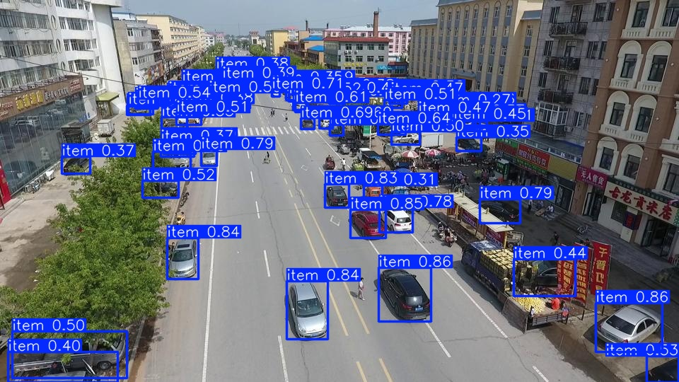

# Детектирование автомобилей в датасете VisDrone.

## Описание
Автоматизация обучения и экспорта моделей YOLO11 на датасете VisDrone

## Установка

### Требования
- Python 3.11 или выше
- CUDA версии 11.8
- `poetry` менеджер пакетов

### Шаги установки на Windows
1. Клонируйте репозиторий:
   ```Powershell
   git clone https://github.com/AntoxaZ18/visdrone.git
   cd visdrone
   ```
2. Установка при помощи пакетного менеджера
   Если хотите чтобы вирутальная среда создалась в папке с проектом
   ```Powershell
   poetry config settings.virtualenvs.in-project true
   ```
   Создайте преднастроенную виртуальную среду
   ```Powershell
   poetry install
   ```
   Активируйте среду при помощи poetry (опционально)
   ```Powershell
   poetry env activate
   ```
### Использование
  1. Настройки проекта хранятся в yaml файле, где прописаны конфигурации каждого этапа\
    так же можно переопределить их при вызове соответствующих методов.
  2. Доступные команды
     - dataset_prepare: (скачивание и подготовка датасета)
     - train_model: (выбор архитектуры модели, тренировка с заданными параметрами и визулизация результатов обучения)
     - validate: (валидация и сравнение моделей после обучения)
     - benchmark: (тестирование скорости и сравнение обученных моделей на разных форматах (onnx, openvino, tensorrt etc))
     - export: (экпорт моделей в формат ONNX)
  3. Обучение можно проводить при помощи jupyter или py файлов. Процесс обучения модели находится в блокноте train.ipynb
  4. Пример инференса модели 
  5. Презентация и отчет по работе [here](./report.pdf)
    


  


