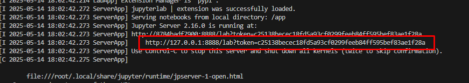

# Детектирование автомобилей в датасете VisDrone.

## Описание
Задача N3 
Разработать модель детекции машин на изображениях с дрона из
датасета VisDrone с использованием YOLO и bounding box. Задача
ориентирована на мониторинг территорий (парковки, дороги). Решение
выложить в Git-репозиторий с коммитами.

Антон Зайцев

## Установка

### Требования
- Python 3.11 или выше
- CUDA версии 11.8
- `poetry` менеджер пакетов
- `docker` если используется контейнер

### Шаги установки на Windows
1. Клонируйте репозиторий:
   ```Powershell
   git clone https://github.com/AntoxaZ18/visdrone.git
   cd visdrone
   ```
2. Установка при помощи пакетного менеджера
   Если хотите чтобы вирутальная среда создалась в папке с проектом
   ```Powershell
   poetry config virtualenvs.in-project true
   ```
   Создайте преднастроенную виртуальную среду
   ```Powershell
   poetry install
   ```
   Активируйте среду при помощи poetry (опционально)
   ```Powershell
   poetry env activate
   ```
   Либо используя make 
   ```Powershell
      make venv_init
   ```
### Использование
  1. Настройки проекта хранятся в yaml файле, где прописаны конфигурации каждого этапа\
    так же можно переопределить их при вызове соответствующих методов.
  2. Доступные команды
     - dataset_prepare: (скачивание и подготовка датасета)
     - train_model: (выбор архитектуры модели, тренировка с заданными параметрами и визулизация результатов обучения)
     - validate: (валидация и сравнение моделей после обучения)
     - benchmark: (тестирование скорости и сравнение обученных моделей на разных форматах (onnx, openvino, tensorrt etc))
     - export: (экпорт моделей в формат ONNX)
  3. Обучение можно проводить при помощи jupyter или py файлов. Процесс обучения модели находится в блокноте train.ipynb
  4. Пример инференса модели 
  5. Презентация и отчет по работе [here](./report.pdf)
  6. Файл loss.py c wasserstein_loss (NWD loss)для замены ultralytics utils.loss.py 
  7. [Репозиторий](https://github.com/AntoxaZ18/onnx_demo) с демо программой 

### Использование совместно с docker
   1. Для сборки образа используйте команду
   ```Powershell
      docker buildx build . -t cuda11 
   ```
   либо
   ```Powershell
      make docker_build
   ```
   2. Для запуска контейнера используйте команду
   ```Powershell
      docker run -p 8888:8888 --rm --gpus all -v .:/app cuda11
   ```
   либо
   ```Powershell
      make docker_run
   ```
   После запуска активируется сервер jupyter. Файлы автоматически подмонтируются. Все модели сохранятся на хосте
   Использовать ссылку для подключения 
   Контейнер автоматически удалится после окончания работы
   3. Очистка системы
   Для удаления образа из системы используйте команду 
   ```Powershell
      docker rmi cuda11:latest -f
   ```
   либо 
   ```Powershell
      make docker_clean
   ```

   Для получения справки по таргетам make используйте make help
    


  


